# Class07: Machine Learning 1
Ami Pant (A15991358)

Today we will begin our exploration of some “classical” machine learning
approaches. We will start with clustering:

Let’s first make up some data cluster where we know what the answer
should be.

``` r
hist(rnorm(1000))
```

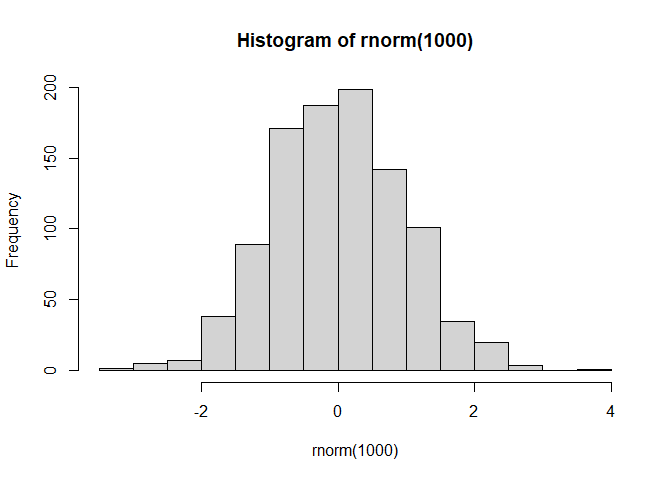

``` r
x <- c(rnorm(30, mean = -3), rnorm(30, mean = 3))

y <- rev(x)

x <- cbind(x, y)
head(x)
```

                 x        y
    [1,] -5.385832 2.836687
    [2,] -2.544259 2.984384
    [3,] -2.077838 3.699932
    [4,] -3.935525 3.773367
    [5,] -3.477913 2.351635
    [6,] -3.911827 3.882438

A wee peak at x with `plot()`

``` r
plot(x)
```

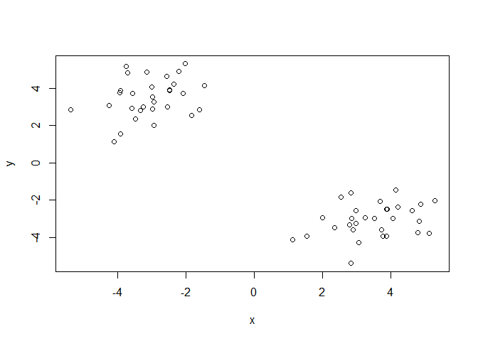

The main function in “base” R for K-means clustering is called
‘kmeans()’.

``` r
k <- kmeans(x, centers = 2)
k
```

    K-means clustering with 2 clusters of sizes 30, 30

    Cluster means:
              x         y
    1 -3.060292  3.485139
    2  3.485139 -3.060292

    Clustering vector:
     [1] 1 1 1 1 1 1 1 1 1 1 1 1 1 1 1 1 1 1 1 1 1 1 1 1 1 1 1 1 1 1 2 2 2 2 2 2 2 2
    [39] 2 2 2 2 2 2 2 2 2 2 2 2 2 2 2 2 2 2 2 2 2 2

    Within cluster sum of squares by cluster:
    [1] 53.86019 53.86019
     (between_SS / total_SS =  92.3 %)

    Available components:

    [1] "cluster"      "centers"      "totss"        "withinss"     "tot.withinss"
    [6] "betweenss"    "size"         "iter"         "ifault"      

> Q. How big are the clusters (i.e their size)?

``` r
k$size
```

    [1] 30 30

> Q. What clusters do my data points reside in?

``` r
k$cluster
```

     [1] 1 1 1 1 1 1 1 1 1 1 1 1 1 1 1 1 1 1 1 1 1 1 1 1 1 1 1 1 1 1 2 2 2 2 2 2 2 2
    [39] 2 2 2 2 2 2 2 2 2 2 2 2 2 2 2 2 2 2 2 2 2 2

> Q. Make a plot of our data colored by cluster assignment - i.e. Make a
> result figure …

``` r
plot(x, col = k$cluster)
points(k$centers, col = "blue", pch = 15)
```

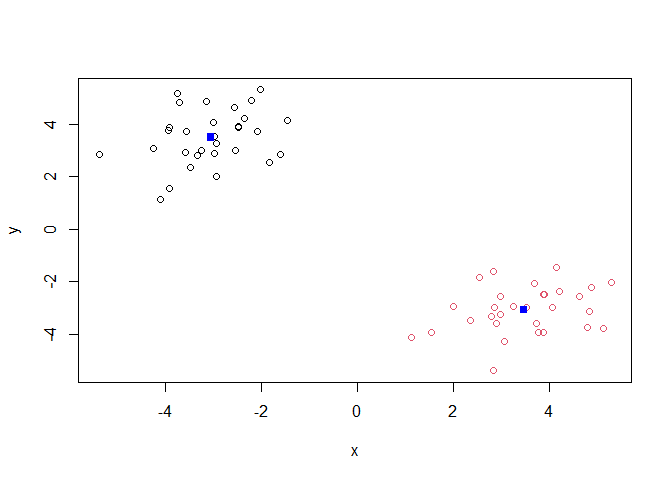

> Q. Cluster with k-means into 4 clusters and plot your results as
> above.

``` r
k4 <- kmeans(x, 4)
plot(x, col = k4$cluster)
points(k4$centers, col = "blue", pch = 15)
```

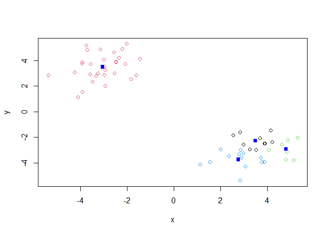

> Q. Run kmenas with center (i.e. values of k) equal 1 to 6

``` r
k1 <- kmeans(x, centers = 1)$tot.withinss
k2 <- kmeans(x, centers = 2)$tot.withinss
k3 <- kmeans(x, centers = 3)$tot.withinss
k4 <- kmeans(x, centers = 4)$tot.withinss
k5 <- kmeans(x, centers = 5)$tot.withinss
k6 <- kmeans(x, centers = 6)$tot.withinss


ans <- c(k1, k2, k3, k4, k5, k6)
```

Or use a for loop

``` r
ans <- NULL

for (i in 1:6) {
  ans <- c(ans, kmeans(x, centers = i)$tot.withinss)
}

ans
```

    [1] 1393.00026  107.72038   84.58651   76.76614   53.90517   44.10789

Make a “scree-plot”

``` r
plot(ans, typ = "b")
```

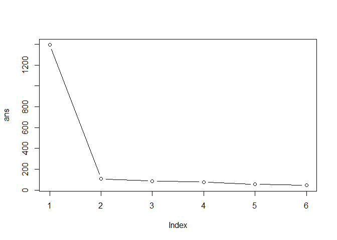

## Heirarchical Clustering

The main function in “base” R for this is called `hclust()`

``` r
 d <- dist(x)
hc <- hclust(d)
hc
```


    Call:
    hclust(d = d)

    Cluster method   : complete 
    Distance         : euclidean 
    Number of objects: 60 

``` r
plot(hc)
abline(h = 7, col = "red")
```

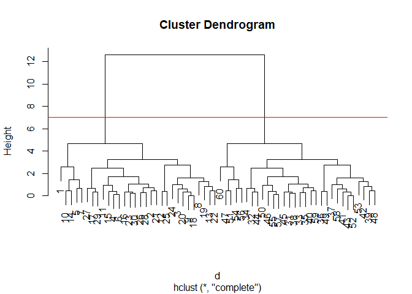

To obtain clusters from our `hclust` result object **hc** we “cut” the
tree to yeild different sub branches. For this we use the `cutree()`
function

``` r
grps <- cutree(hc, h = 7)
grps
```

     [1] 1 1 1 1 1 1 1 1 1 1 1 1 1 1 1 1 1 1 1 1 1 1 1 1 1 1 1 1 1 1 2 2 2 2 2 2 2 2
    [39] 2 2 2 2 2 2 2 2 2 2 2 2 2 2 2 2 2 2 2 2 2 2

``` r
plot(x, col = grps)
```

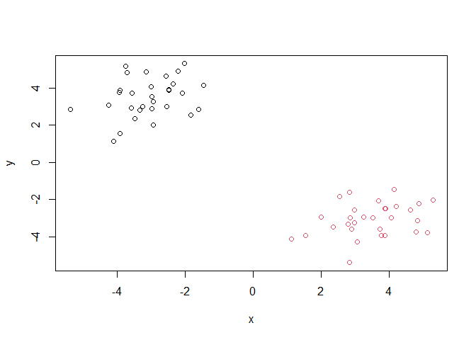

``` r
library(pheatmap)
```

    Warning: package 'pheatmap' was built under R version 4.3.3

``` r
pheatmap(x)
```

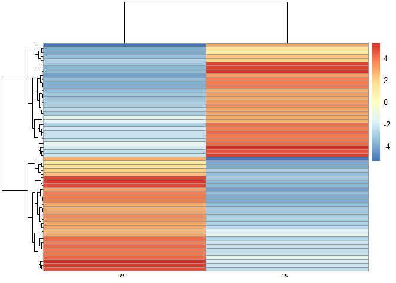

## Principal Component Analysis (PCA)

``` r
url <- "https://tinyurl.com/UK-foods"
x <- read.csv(url)
```

> Q1. How many rows and columns are in your new data frame named x? What
> R functions could you use to answer this questions?

``` r
dim(x)
```

    [1] 17  5

There are 17 rows and 5 columns.

``` r
## Preview the first 6 rows
head(x)
```

                   X England Wales Scotland N.Ireland
    1         Cheese     105   103      103        66
    2  Carcass_meat      245   227      242       267
    3    Other_meat      685   803      750       586
    4           Fish     147   160      122        93
    5 Fats_and_oils      193   235      184       209
    6         Sugars     156   175      147       139

> Q2. Which approach to solving the ‘row-names problem’ mentioned above
> do you prefer and why? Is one approach more robust than another under
> certain circumstances?

``` r
x <- read.csv(url, row.names=1)
head(x)
```

                   England Wales Scotland N.Ireland
    Cheese             105   103      103        66
    Carcass_meat       245   227      242       267
    Other_meat         685   803      750       586
    Fish               147   160      122        93
    Fats_and_oils      193   235      184       209
    Sugars             156   175      147       139

``` r
dim(x)
```

    [1] 17  4

I prefer the `read.csv()` method to solve the row-names problem because
it requires much less code. Using the `read.csv()` approach is more
robust because it reads the row names correctly and there is no risk of
losing other columns in the data frame.

``` r
# Using base R
barplot(as.matrix(x), beside=T, col=rainbow(nrow(x)))
```

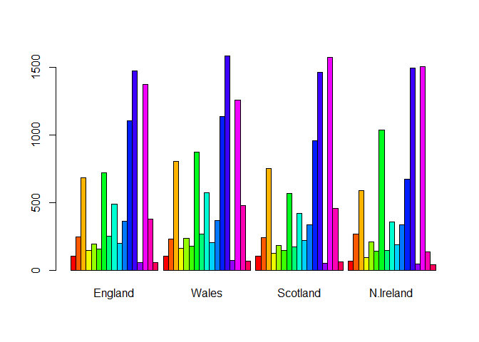

> Q3: Changing what optional argument in the above barplot() function
> results in the following plot?

Setting the beside arguemnt of barplot to FALSE, which is the default,
results in stacked bars.

``` r
# Using base R
barplot(as.matrix(x), beside=F, col=rainbow(nrow(x)))
```

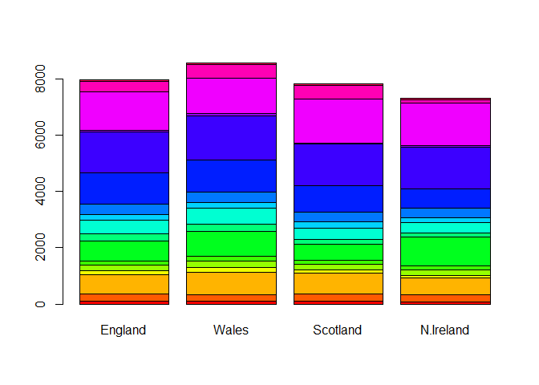

## Paires plote and heatmaps

Scatterplot matricies (aka “pairs plots”)

> Q5: We can use the pairs() function to generate all pairwise plots for
> our countries. Can you make sense of the following code and resulting
> figure? What does it mean if a given point lies on the diagonal for a
> given plot?

The argument x is the data input into the function, which in this case
is the complete data frame. The col argument is setting each point a
different colors of the rainbow based on the number of rows in the data
frame. The pch argument is changing the shape of all the points in the
plot. The resulting figure is a visualization of each country compared
with one another. If a point lies on the the diagonal it means the value
is similar for both countries being compared in that plot.

``` r
pairs(x, col=rainbow(nrow(x)), pch=16)
```

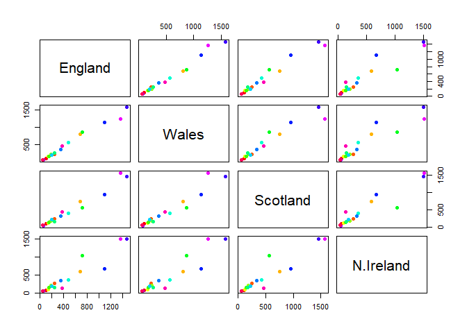

> Q6. Based on the pairs and heatmap figures, which countries cluster
> together and what does this suggest about their food consumption
> patterns? Can you easily tell what the main differences between N.
> Ireland and the other countries of the UK in terms of this data-set?

``` r
library(pheatmap)

pheatmap( as.matrix(x) )
```


England and Wales cluster together, which suggests that they have
similar food consumption patterns. It is still difficult to draw
conclusions with this kind of clustering method and visualization
despite it being a smaller data frame.

## PCA to the rescue

The main function in “base” R for PCA is called `prcomp()`.

As we want to do PCA on the food data for the different countries, we
will want the foods in the columns.

``` r
pca <- prcomp(t(x))
summary(pca)
```

    Importance of components:
                                PC1      PC2      PC3       PC4
    Standard deviation     324.1502 212.7478 73.87622 3.176e-14
    Proportion of Variance   0.6744   0.2905  0.03503 0.000e+00
    Cumulative Proportion    0.6744   0.9650  1.00000 1.000e+00

Our result object is called `pca` and it has a `$x` component that we
will look at first

``` r
pca$x
```

                     PC1         PC2        PC3           PC4
    England   -144.99315   -2.532999 105.768945 -4.894696e-14
    Wales     -240.52915 -224.646925 -56.475555  5.700024e-13
    Scotland   -91.86934  286.081786 -44.415495 -7.460785e-13
    N.Ireland  477.39164  -58.901862  -4.877895  2.321303e-13

> Q7. Complete the code below to generate a plot of PC1 vs PC2. The
> second line adds text labels over the data points.

``` r
library(ggplot2)

ggplot(pca$x) +aes(PC1, PC2, label = rownames(pca$x)) +
  geom_point() +
  geom_text() 
```

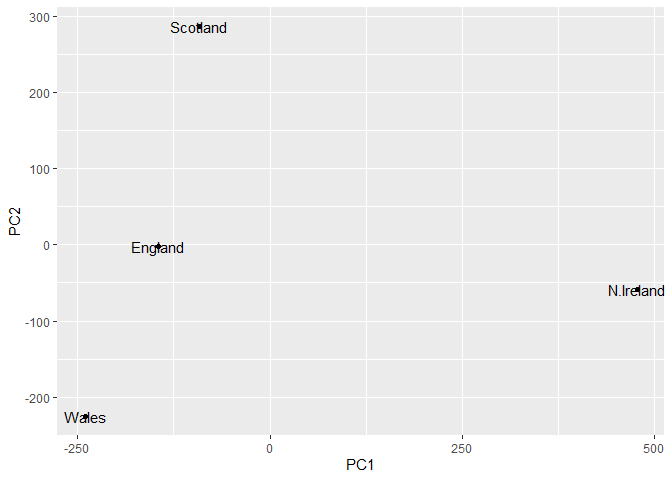

> Q8. Customize your plot so that the colors of the country names match
> the colors in our UK and Ireland map and table at start of this
> document.

``` r
cols <- c("orange", "red", "blue", "darkgreen")
ggplot(pca$x) +aes(PC1, PC2, label = rownames(pca$x)) +
  geom_point() +
  geom_text(col = cols) 
```

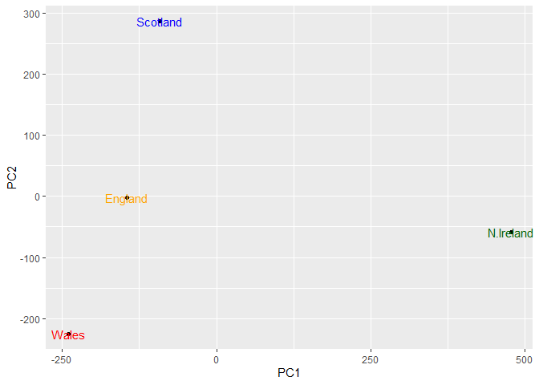

Another major result out of PCA is the so-called “variable loadings” or
`$rotation` that tells us how the original variables (foods) contribute
to the PCs (i.e. our new axis).

``` r
pca$rotation
```

                                 PC1          PC2         PC3          PC4
    Cheese              -0.056955380  0.016012850  0.02394295 -0.694538519
    Carcass_meat         0.047927628  0.013915823  0.06367111  0.489884628
    Other_meat          -0.258916658 -0.015331138 -0.55384854  0.279023718
    Fish                -0.084414983 -0.050754947  0.03906481 -0.008483145
    Fats_and_oils       -0.005193623 -0.095388656 -0.12522257  0.076097502
    Sugars              -0.037620983 -0.043021699 -0.03605745  0.034101334
    Fresh_potatoes       0.401402060 -0.715017078 -0.20668248 -0.090972715
    Fresh_Veg           -0.151849942 -0.144900268  0.21382237 -0.039901917
    Other_Veg           -0.243593729 -0.225450923 -0.05332841  0.016719075
    Processed_potatoes  -0.026886233  0.042850761 -0.07364902  0.030125166
    Processed_Veg       -0.036488269 -0.045451802  0.05289191 -0.013969507
    Fresh_fruit         -0.632640898 -0.177740743  0.40012865  0.184072217
    Cereals             -0.047702858 -0.212599678 -0.35884921  0.191926714
    Beverages           -0.026187756 -0.030560542 -0.04135860  0.004831876
    Soft_drinks          0.232244140  0.555124311 -0.16942648  0.103508492
    Alcoholic_drinks    -0.463968168  0.113536523 -0.49858320 -0.316290619
    Confectionery       -0.029650201  0.005949921 -0.05232164  0.001847469

``` r
ggplot(pca$rotation) +
  aes(PC1, rownames(pca$rotation)) +
  geom_col()
```

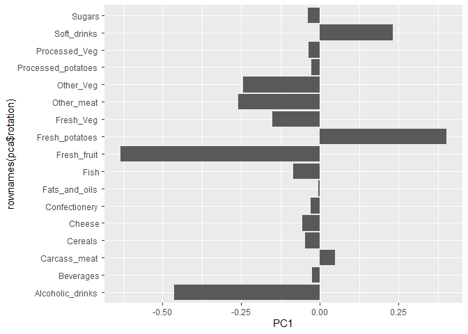

> Q9: Generate a similar ‘loadings plot’ for PC2. What two food groups
> feature prominantely and what does PC2 maninly tell us about?

``` r
ggplot(pca$rotation) +
  aes(PC2, rownames(pca$rotation)) +
  geom_col()
```

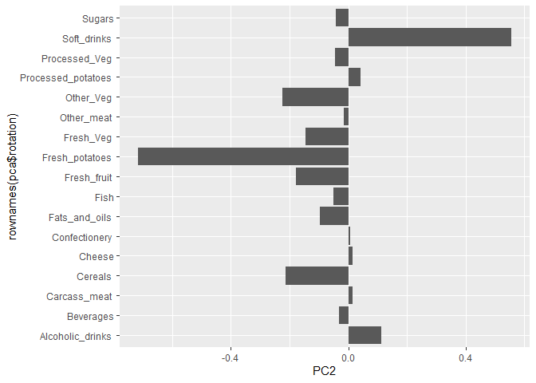

Based on the loading plot of PC2, it seems fresh potatoes and soft
drinks are the most prominent. PC2 mainly tells us which groups have the
second most variation independent of the first principle component.
