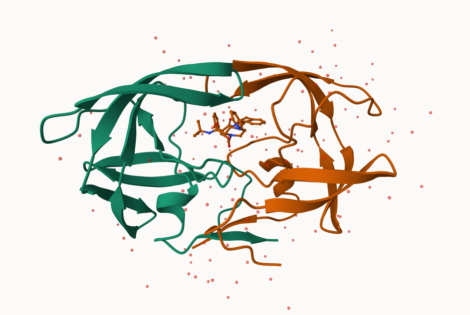

## The PDB Database

The main repository for biomolecular structure data it the Protein Data Bank (PDB) http://www.rcsb.org

Let's have a quick look at the composition of this database: 

```{r}
stats <- read.csv("Data_Export_Summary.csv")
stats
```

```{r}
stats$X.ray

as.numeric(sub(",", "", stats$X.ray))

```

This is annoying lets try a different import function from the **readr** package. 

```{r}
library(readr)
```


```{r}
stats <- read_csv("Data_Export_Summary.csv")
stats
```

> Q1: What percentage of structures in the PDB are solved by X-Ray and Electron Microscopy.

```{r}

n.total <- sum(stats$Total)
n.xray <- sum(stats$`X-ray`)
n.em <- sum(stats$EM)

round(n.xray/n.total * 100, 3)

round(n.em/n.total * 100, 3)

```

81.432% of the structures in PDB are solved by x-ray and 12.271% of structures are solved by electron microscopy. 

> Q2: What proportion of structures in the PDB are protein only?

```{r}

round(stats$Total[1]/n.total, 4)

```

0.8605 of the the structure in PDB are protein only.

> Q3. Make a bar plot overview of Molecular type composition using ggplot

```{r}
library(ggplot2)

experiment_method <- colnames(stats)
experiment_method <- experiment_method[-8]

ggplot(stats) +aes(reorder(`Molecular Type`, -Total), Total) +geom_col() +labs(title = "PDB Database Composition Oct 2025") + theme(axis.text.x = element_text(angle = 45, hjust = 1))

```


## Visualizing structure data

The Mol* viewer is embedded in many bioinformatics websites. The homepage is https://molstar.org

I can insert any figure of image file using markdown format.




> Q3: Type HIV in the PDB website search box on the home page and determine how many HIV-1 protease structures are in the current PDB?

.png)

There are 2 protease structures in the current PDB (it is a dimer)

>  Q4: Water molecules normally have 3 atoms. Why do we see just one atom per water molecule in this structure?

We only see one atom per water molecule because the hydrogens are so small they don't show up when using xray.

> Q5: There is a critical “conserved” water molecule in the binding site. Can you identify this water molecule? What residue number does this water molecule have

The critical conserved water molecule is residue 308.

> Q6: Generate and save a figure clearly showing the two distinct chains of HIV-protease along with the ligand. You might also consider showing the catalytic residues ASP 25 in each chain and the critical water (we recommend “Ball & Stick” for these side-chains). Add this figure to your Quarto document.

.png)

## Bio3D package for structural bioinformatics

We can use the bio3d package to read an analyze biomolecular data in R:

```{r}
library(bio3d)

hiv <- read.pdb("1hsg")
hiv

```

> Q7: How many amino acid residues are there in this pdb object?

There are 198 amino acid residues in this object. Each chain is 99 amino acids long.

> Q8: Name one of the two non-protein residues? 

MK1 is one of the two non-protein residues

> Q9: How many protein chains are in this structure? 

There are two protein chains in this structure. It is a dimer.


```{r}
head(hiv$atom)
```


Let's get the sequence

```{r}
pdbseq(hiv)
```

Let's trim to chain A and get just it's sequence:

```{r}
chainA <- trim.pdb(hiv, chain = "A")
chainA.seq <- pdbseq(chainA)
```

Let's blast 

```{r blast_hiv, cache = TRUE}

blast <- blast.pdb(chainA.seq)

```

```{r}
head(blast$hit.tbl)
```

Plot a quick overview of blast results

```{r}
hits <- plot(blast)
```

```{r}
hits$pdb.id
```

## Prediction of functional motions

We can run a Normal Mode Analysis (NMA) to predict large scale motions/flexibility/dynamics of any biomolecule  that we can read into R. 

> Q10. Which of the packages above is found only on BioConductor and not CRAN? 

the msa package is found in Bioconductor and not CRAN. 


> Q11. Which of the above packages is not found on BioConductor or CRAN?

The Grantlab/bio3d-view package is not found in Bioconductor nor CRAN.

> Q12. True or False? Functions from the devtools package can be used to install packages from GitHub and BitBucket? 

True, functions from the devtools package can be used to install packages from GitHub and BitBucket.


Let's look at ADK

```{r}
adk <- read.pdb("1ake")
adk_A <- trim.pdb(adk, chain = "A")
adk_A

```

> Q13. How many amino acids are in this sequence, i.e. how long is this sequence? 

There are 214 amino acids in this sequence.


```{r}
m <- nma(adk_A)
plot(m)
```

Let's write the "trajectory" of predicted motion
```{r}
mktrj(m, file = "adk_nma.pdb")
```

## Play with 3D viewing in R

We can use the new **bio3dview** package, which is not yet on CRAN, to render interactive 3D views in R and HTML quarto output reports. 

To install from GitHub we can use the **pak** package.
```{r}
#library(bio3dview)
#view.pdb(adk)
```


## Comparitive analysis of protein structures

Starting with a sequence or structure ID (accession number) let's run a complete analysis pipeline.

```{r}
library(bio3d)
id <-  "1ake_A"
aa <- get.seq(id)
aa
```

```{r, cache = T}
blast <- blast.pdb(aa)
hits <- plot(blast)


```

```{r}
hits$pdb.id
```

Download all these "hits" that are similar to our starting id sequence

```{r}
files <- get.pdb(hits$pdb.id, path = "pdbs", split = T, gzip = T)
```


```{r}
pdbs <- pdbaln(files, fit = T, exefile = "msa")
```

```{r}
pca.xray <- pca(pdbs)
plot(pca.xray)
```


```{r}
plot(pca.xray, 1:2)
```

```{r}
mktrj(pca.xray, file = "pca_result.pdb")
```

```{r}
library(bio3dview)
view.pca(pca.xray)
```

