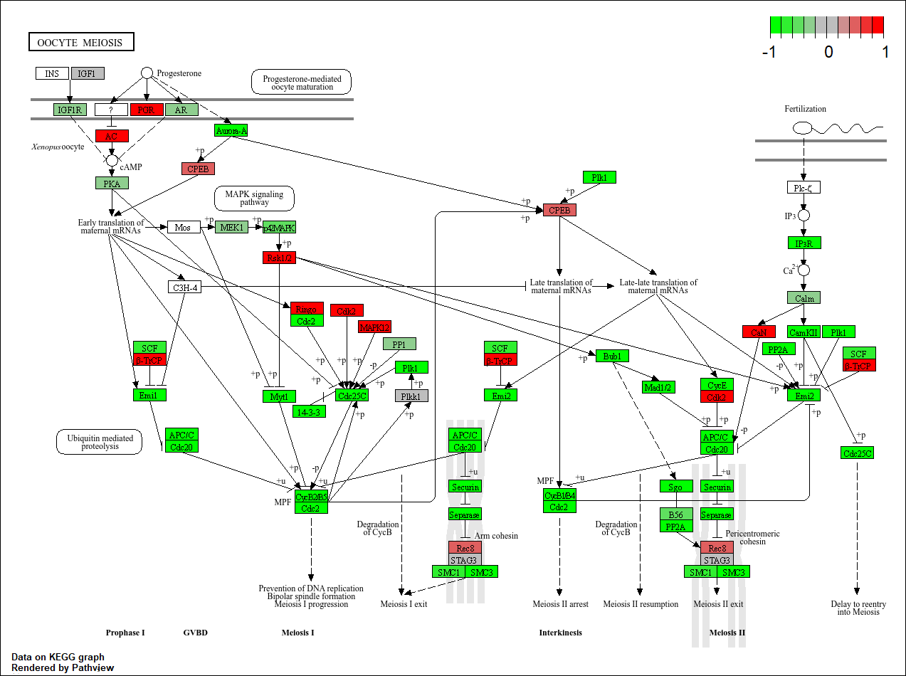
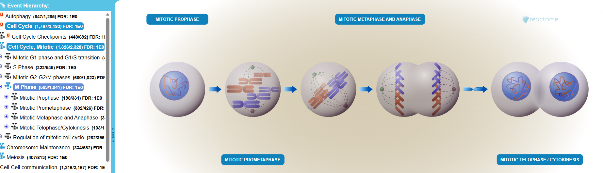

## Background

Today we will run through a complete RNASeq analysis 

The data for for hands-on session comes from GEO entry: GSE37704, which is associated with the following publication:

Trapnell C, Hendrickson DG, Sauvageau M, Goff L et al. "Differential analysis of gene regulation at transcript resolution with RNA-seq". Nat Biotechnol 2013 Jan;31(1):46-53. PMID: 23222703

The authors report on differential analysis of lung fibroblasts in response to loss of the developmental transcription factor HOXA1. Their results and others indicate that HOXA1 is required for lung fibroblast and HeLa cell cycle progression.

## Data Import

```{r}
counts <- read.csv("GSE37704_featurecounts.csv", row.names = 1)

metadata <- read.csv("GSE37704_metadata.csv", row.names = 1)
```

Check for correspondence of `metadata` and `counts` (i.e. that the columns in `counts` match the rows in the `metadata`)

```{r}
head(counts)
```


```{r}
metadata
```

```{r}
colnames(counts)
```

```{r}
metadata$id
```

Fix to remove the first "length" column of `counts`

> Q. Complete the code below to remove the troublesome first column from counts

```{r}
counts <- counts[,-1]
```


```{r}
test_cols <- !all(colnames(counts) == metadata$id)
```

```{r}
if(test_cols) {
  message("Wow there is a problem with the metadata counts setup")
}
```


## Setup for DESeq

We need to remove the zero counts from the counts table
```{r}
tot.counts <- rowSums(counts)
head(tot.counts)
```

```{r}
zero.inds <- tot.counts == 0
head(zero.inds)
```

> Q. Complete the code below to filter countData to exclude genes (i.e. rows) where we have 0 read count across all samples (i.e. columns).

```{r}
counts <- counts[!zero.inds,]

```


```{r, message = F}
library(DESeq2)
```

```{r}
dds <- DESeqDataSetFromMatrix(countData = counts, colData = metadata, design = ~condition)
```

## Run DESeq

```{r}
dds <- DESeq(dds)
```

## Get Results

```{r}
res <- results(dds)
```

> Q. Call the summary() function on your results to get a sense of how many genes are up or down-regulated at the default 0.1 p-value cutoff.

```{r}
summary(res)
```


```{r}
head(res)
```

## Add annotation

```{r}
library(AnnotationDbi)
library(org.Hs.eg.db)
```

> Q. Use the mapIDs() function multiple times to add SYMBOL, ENTREZID and GENENAME annotation to our results by completing the code below.

```{r}
res$symbol = mapIds(org.Hs.eg.db,
                    keys= row.names(res), 
                    keytype="ENSEMBL",
                    column= "SYMBOL",
                    multiVals="first")

res$entrez = mapIds(org.Hs.eg.db,
                    keys= row.names(res),
                    keytype="ENSEMBL",
                    column="ENTREZID",
                    multiVals="first")

res$name =   mapIds(org.Hs.eg.db,
                    keys=row.names(res),
                    keytype= "ENSEMBL",
                    column="GENENAME",
                    multiVals="first")

head(res, 10)
```

```{r}
nrow(res)
```


## Visualize results 

```{r}
library(ggplot2)

```

> Q. Improve this plot by completing the below code, which adds color and axis labels

```{r}
my_cols <- rep("grey", nrow(res))
my_cols[abs(res$log2FoldChange < 2)] <- "blue"
my_cols[abs(res$log2FoldChange) > 2] <- "blue"

ggplot(res) +aes(log2FoldChange, -log(padj)) +geom_point(col = my_cols) +geom_vline(xintercept = c(-2,2), col = "red") +geom_hline(yintercept = -log(0.05), col = "red") +labs(y = "-Log(P-value)", x = "Log2(FoldChange)")
```


## Pathway analysis

```{r}
library(gage)
library(gageData)
library(pathview)

```

```{r}
data(kegg.sets.hs)
data(sigmet.idx.hs)

# Focus on signaling and metabolic pathways only
kegg.sets.hs = kegg.sets.hs[sigmet.idx.hs]

# Examine the first 3 pathways
head(kegg.sets.hs, 3)
```

```{r}
foldchanges <- res$log2FoldChange
names(foldchanges) <- res$entrez
head(foldchanges)
```

```{r}
keggres <- gage(foldchanges, gsets=kegg.sets.hs)
```

```{r}
head(keggres$less)
```


```{r}
pathview(gene.data = foldchanges, pathway.id = "hsa04110" )
```

> Q. Can you do the same procedure as above to plot the pathview figures for the top 5 down-reguled pathways?

```{r, message = F}
library(dplyr)

keggrespathways <- rownames(keggres$less)[1:5]

# Extract the 8 character long IDs part of each string
keggresids = substr(keggrespathways, start=1, stop=8)
keggresids
```

```{r}
pathview(gene.data = foldchanges, pathway.id = keggresids, species = "hsa" )
```





## GO Analysis

Let's try GO analysis and compare to KEGG analysis

```{r}
data(go.sets.hs)
data(go.subs.hs)

# Focus on Biological Process subset of GO
gobpsets <- go.sets.hs[go.subs.hs$BP]

gobpres <- gage(foldchanges, gsets=gobpsets)

```

> Q: What pathway has the most significant “Entities p-value”? Do the most significant pathways listed match your previous KEGG results? What factors could cause differences between the two methods?

```{r}
head(gobpres$less)

```

Based on the GO analysis, cell division/cell cycle pathway has the most significant entities.This does match the general cell cycle pathway that my previous KEGG results show but this is more speciifcally listing cell functions. Gene ontology focuses on cell function more than exact pathways, unlike KEGG, which is why the results don't show exact protein  protein pathways. 


## Reactome

Some folks like Reactome online (i.e. their webpage viewer) rather than the R package of the same name (available from bioconductor).

To use the website viewer we want to upload our set of gene symbols for the genes we want to focus on (here those with a P-value below 0.05)

```{r}
sig_genes <- res[res$padj <= 0.05 & !is.na(res$padj), "symbol"]
print(paste("Total number of significant genes:", length(sig_genes)))
```

> Q: What pathway has the most significant “Entities p-value”? Do the most significant pathways listed match your previous KEGG results? What factors could cause differences between the two methods?

The cell cycle pathway has the most significant entities. This does match my previous KEGG result. The two methods draw from different databases. The KEGG database is primarily comprised of metabolic pathways unlike reactome which is more focused on signal transduction and other non-metabolic processes pathways (broader than KEGG). 

```{r}
write.table(sig_genes, file="significant_genes.txt", row.names=FALSE, col.names=FALSE, quote=FALSE)
```



> Q. Finally for this section let's reorder these results by adjusted p-value and save them to a CSV file in your current project directory.

## Save results 

```{r}
res <- res[order(res$pvalue),]
```


```{r}
write.csv(res, file = "my_results.csv")

save(res, file = "my_results.RData")
```

